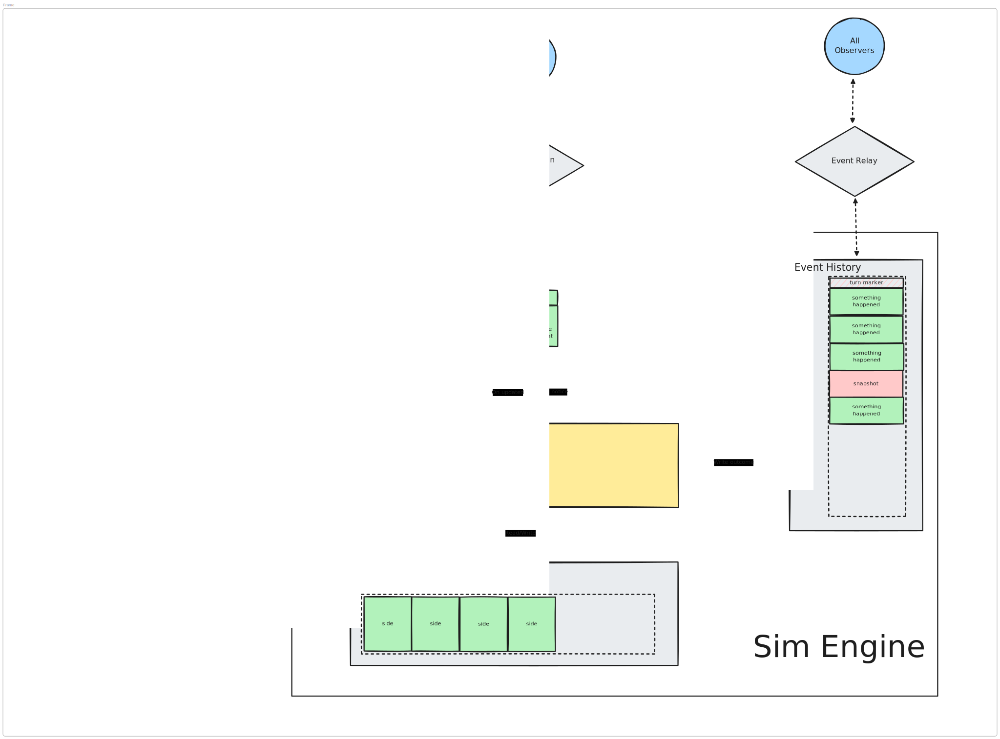

# Combat Simulator Engine
A "machine" that processes combat given a set of intal configs. Input and output is platform agnostic, a CLI is provided for testing.
## Overview

### Core
The core functionality of the combat engine.
### Data
Data that can be loaded for a given simulator. Some "core" or "common" data entries may exist in core.
### Extensions
Extra items which build on the core functionality.
## General Todos:
- [ ] Plugin structure - allow custom (data) sets of
	- [ ] Actions/moves
	- [ ] Monsters
	- [ ] Components
- [ ] History relay
	- [ ] Make updates subscribe-able 
- [ ] Rename to "Combat Simulator Engine" (do before merge)
- [ ] Ensure consistent naming across all files
	- [ ] Appendix? 