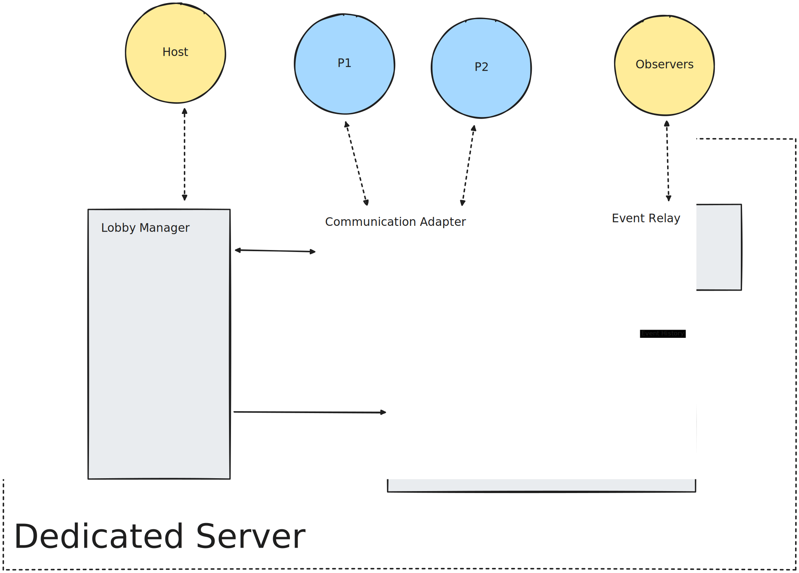

# Local Multiplayer Prototype / Demo



- Connect via IP + Port
  - Not using propper auth
  - Over websockets (socket.io)
- Host
  - CLI controlled
- Player
  - GUI

## Run instructions

For host server

```sh
ts-node ./app.ts
```

For player frontend server

```sh
npm run dev
```

# Player/Client Procedure
## Steps
Once the client has connected successfully...
### 1: Request Information
- Game State
  - Event History
- Player Information
### 2: Check Notices
- Trigger popups to resolve notices
## Concerns
> What happens when disconnected?

This should be designed in a way such that connecting makes no difference between whether the battle is in progress or not.